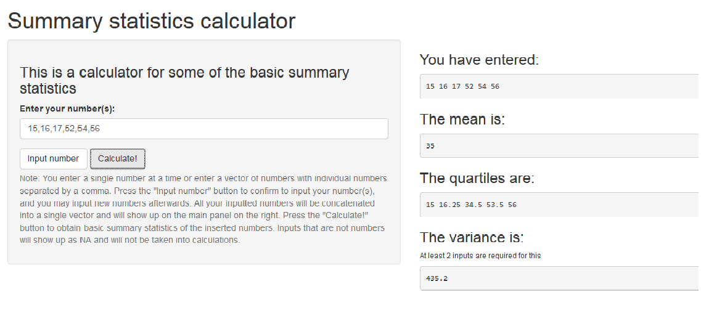

## Slide 2

### The main purpose of this shiny application is to calculate the basic summary statistics (mean, variance, quartiles) of a given vector of numbers.

--- 

## Slide 3

### The application is fairly straightforward:

* You type in a number (e.g. '12') or some numbers separated by commas (e.g. '22,23,24') and press the 'Input number button to confirm your input. You can input numbers as many times as you like, and they will all be combined into a single vector.

* You press 'Calculate!' when you are done inputting numbers to obtain the statistics.

---

## Slide 4

Example:

---

## Slide 5

### The application has the merit of being easy and simple, but comes with some drawbacks due to that reason:

* It cannot deal with/distinguish multiple vectors of data.

* It cannot deal with direct input of datasets in the forms (e.g. excel spreadsheets).

* Lacks other methods of data presentation (e.g. histograms)
